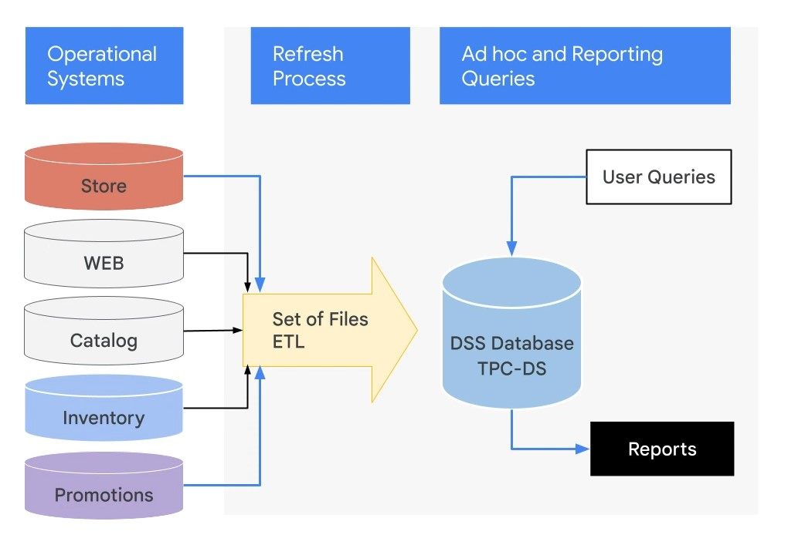

# Modernizing Data Lakes and Data Warehouses with Google Cloud

### **Course Overview**

1. Data Engineer's roles and responsibilities, their clients.

2. Benefits of successful data pipeline.

3. Why data engineering should be done in Cloud Environment.

4. Building Data Lake and it's solution in Google Cloud.

5. Building Data Warehouse and it's solution in Google Cloud.

 

---

 

### **The Role of Data Engineer**

 

A Data Engineer builds data pipelines.  
This is done to make the data reach somewhere like Dashboard or Report or ML learning Model from where business can make data driven decisions.

The data must be in usable conditions. Raw data is not useful.

A **Data Lake** brings data together from across the enterprise into a single location. Eg: Data coming from RDB or Spreadsheet and stored in Data Lake.

One option is to store all raw data in a Cloud Storage Bucket.

 

_**Key considerations when deciding Data Lake options?**_

- Does data lake handle all types of data you have?
- Can it fit in a cloud storage bucket?
  > Cloud SQL is better storage option for RDBMS than Cloud Storage.
- Can it scale to meet demand?
- Does it support high throughput ingestion? Network bandwidth or do you have edge points of presence?
- Is there fine grained access control to objects? Do users need to seek within file or enough to get a file as whole?
  > Cloud Storage is blob storage therefore you need to consider what you store.
- Can other tools connect easily? How do they access storage?

As a Data Engineer it is common to use Cloud Storage bucket to store your Raw data files such as CSV, JSON or avro.  
The data stored here can then directly be queries from BigQuery as a Data Warehouse.

If your Raw Data need additional process, you may need to extract the data from it's original position, transform it and then load it in. Technologies for processing data using Batch Data pipelines are: **Dataproc** and **Dataflow**.

For data that arrives continuously and endlessly for the purpose of Real-Time data analytics, you might receive data in **Pub/Sub**, transform it using **Dataflow**, and stream it into **BigQuery**.

 

### **Challenges faced by Data Engineers**

 

1. Difficult to access data.

2. Data accuracy and quality is not up to mark to perform data analytics or build ML models.

3. Transformations might require computations resources not available to you.

4. Query performance issues when running all the queries and transformations.

**Access to Data**

Disperate Data Types, data formats and managing access at scale.

_**Q.** How much does it cost in marketing, discounts and promotions to acquire a customer?_

This data might be scattered across marketing products and CRM software.

Finding a tool that can organize this data might be difficult as this data might be coming from different organizations, different tools and schemas. Some data might not even be strucutred.

**In order to calculate this you can't have your data exist in silos.**

- Data is often siloed across departments.
- Each department creates it's own transactional systems to support it's own business processes.
- Running a query to get all in-store promotions for recent orders, inventory levels will be very difficult as stored in separate systems and restricted access.

 

**Data Accuracy and Quality**

Cleaning formatting and getting data ready for insights requires you to build ETL pipelines.

**ETL pipelines** are usually necessary for data accuracy and quality.

The cleaned and transformed data are stored not in a lake but a Data Warehouse.

**Data Warehouse** is a consolidated place to store the data. All the data is easily joinable and queriable.

**Compared to Data Lake where data is stored in raw format, in Data Warehouse the data is stored in a way that is efficient to query.**

Any data that you collect from source systems must be cleaned and transformed.

_**Q.** As a retailer you want to consolidate data from multiple sources to get best performing in store promotions in France._

- You have to get data from Store and you have to get data from promotions.
- Perhaps Store data is missing info.
  - For some transaction there is no info on who the customer is.
  - Some transactions are spread over multiple receipts so you will have to consolidate receipts for same customer.
  - Timestamps of the product are stored in local time so you will have to convert everything into UTC.
- Similarly promotions may not be stored in transactional datbase at all. They might be text file that somebody loads on their web page and a list of calls by the web app are used to apply discounts.
- Finding the best performing promotions might be difficult because the data has so many problems.
- Data must be converted to a form to carry analysis.
- Best if you can do this cleanup and conslidation just ones and store the resulting data for further analysis easy. This is the point of having Data Warehouse.

 

**Availability of Computational resources.**

 

In On-Prem Data Engineers have to manage server and ensure enough cluster capacity to carry out ETL jobs.

Also the compute neede by ETL jobs is not constant.

Most times it is dependent on holidays and promotional sales so when the traffic is low you are wasting money and when high your jobs are taking long.

 

**Query Performance**

 

You need to optimize the queries you are running to make most efficient use of your computer resources.

If managing On-Prem data analytics cluster, you will be choosing a query engine and installing it and keeping it up to date as well as managing any servers for additional capacity.

 

### **Introduction to BigQuery**

 

**BigQuery** is Google's petabyte scale serverless data warehouse.

This means that you don't have to worry about clusters and can focus on insights.

1. It servers as the collective home for all analytical data in an organization.

2. **Datasets** are collection of tables that can be divided along business lines. In Google each dataset is tied to a **Google cloud project**.

3. A data lake might contain data from Cloud Storage, Google Drive. Or even transactional data from Cloud Bigtable. BigQuery can define schema and issue queries on external data as federated data sources.

4. Database tables and views function the same way in BigQuery as in a Data Warehouse. Allowing support for queries written in SQL.

5. Identity and Access management is used to grant permissiosn to perform specific actions.

> You don't need to provision any resources before using BigQuery. It allocates and deallocates resources dynamically based on usage patterns like adding data, tables or removing them.
>
> Query resources are allocated based on query type and complexity.
