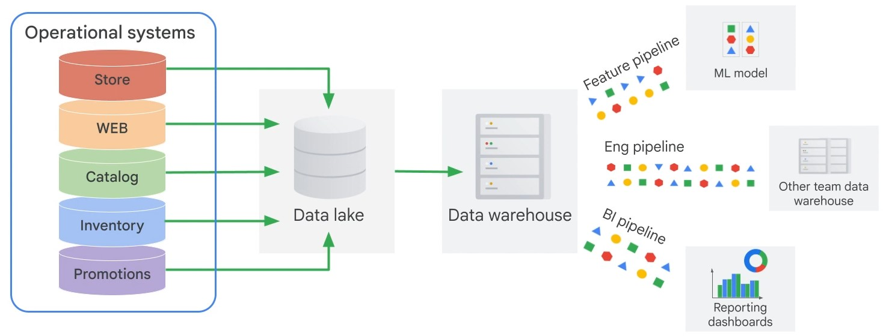

# Modernizing Data Lakes and Data Warehouses with Google Cloud Part 1

### **Course Overview**

1. Data Engineer's roles and responsibilities, their clients.

2. Benefits of successful data pipeline.

3. Why data engineering should be done in Cloud Environment.

4. Building Data Lake and it's solution in Google Cloud.

5. Building Data Warehouse and it's solution in Google Cloud.

 

---

 

## **The Role of Data Engineer**

 

### **1. Get the data to where it can be useful**

A Data Engineer builds data pipelines.  
This is done to make the data reach somewhere like Dashboard or Report or ML learning Model from where business can make data driven decisions.

The data must be in usable conditions. Raw data is not useful.

A **Data Lake** brings data together from across the enterprise into a single location. Eg: Data coming from RDB or Spreadsheet and stored in Data Lake.

As a Data Engineer it is common to use Cloud Storage bucket to store your Raw data files such as CSV, JSON or avro.

The data stored here can then directly be queries from BigQuery as a Data Warehouse.

 

_**Key considerations when deciding Data Lake options?**_

- Does data lake handle all types of data you have?
- Can it fit in a cloud storage bucket?
  > Cloud SQL is better storage option for RDBMS than Cloud Storage.
- Can it scale to meet demand?
- Does it support high throughput ingestion? Network bandwidth or do you have edge points of presence?
- Is there fine grained access control to objects? Do users need to seek within file or enough to get a file as whole?
  > Cloud Storage is blob storage therefore you need to consider what you store.
- Can other tools connect easily? How do they access storage?

> **Important**
>
> If your Raw Data need additional process, you may need to extract the data from it's original position, transform it and then load it in. Technologies for processing data using Batch Data pipelines are: **Dataproc** and **Dataflow**.
>
> For data that arrives continuously and endlessly for the purpose of Real-Time data analytics, you might receive data in **Pub/Sub**, transform it using **Dataflow**, and stream it into **BigQuery**.

 

**Challenges faced by Data Engineers**

- **Difficult to access Data**

  Disperate Data Types, data formats and managing access at scale.

  _**Q.** How much does it cost in marketing, discounts and promotions to acquire a customer?_

  This data might be scattered across marketing products and CRM software.

  Finding a tool that can organize this data might be difficult as this data might be coming from different organizations, different tools and schemas. Some data might not even be strucutred.

  **In order to calculate this you can't have your data exist in silos.**

  

  - Data is often siloed across departments.
  - Each department creates it's own transactional systems to support it's own business processes.
  - Running a query to get all in-store promotions for recent orders, inventory levels will be very difficult as stored in separate systems and restricted access.

   

- **Data Accuracy and Quality**

  Cleaning formatting and getting data ready for insights requires you to build ETL pipelines.

  **ETL pipelines** are usually necessary for data accuracy and quality.

  The cleaned and transformed data are stored not in a lake but a Data Warehouse.

  **Data Warehouse** is a consolidated place to store the data. All the data is easily joinable and queriable.

  **Compared to Data Lake where data is stored in raw format, in Data Warehouse the data is stored in a way that is efficient to query.**

  Any data that you collect from source systems must be cleaned and transformed.

  _**Q.** As a retailer you want to consolidate data from multiple sources to get best performing in store promotions in France._

  

  - You have to get data from Store and you have to get data from promotions.
  - Perhaps Store data is missing info.
    - For some transaction there is no info on who the customer is.
    - Some transactions are spread over multiple receipts so you will have to consolidate receipts for same customer.
    - Timestamps of the product are stored in local time so you will have to convert everything into UTC.
  - Similarly promotions may not be stored in transactional datbase at all. They might be text file that somebody loads on their web page and a list of calls by the web app are used to apply discounts.
  - Finding the best performing promotions might be difficult because the data has so many problems.
  - Data must be converted to a form to carry analysis.
  - Best if you can do this cleanup and conslidation just ones and store the resulting data for further analysis easy. This is the point of having Data Warehouse.

     

- **Availability of Computational resources.**

  In On-Prem Data Engineers have to manage server and ensure enough cluster capacity to carry out ETL jobs.

  Also the compute neede by ETL jobs is not constant.

  Most times it is dependent on holidays and promotional sales so when the traffic is low you are wasting money and when high your jobs are taking long.

     

- **Query Performance**

  You need to optimize the queries you are running to make most efficient use of your computer resources.

  If managing On-Prem data analytics cluster, you will be choosing a query engine and installing it and keeping it up to date as well as managing any servers for additional capacity.

   

### **Introduction to BigQuery**

 

**BigQuery** is Google's petabyte scale serverless data warehouse.

This means that you don't have to worry about clusters and can focus on insights.

1. It servers as the collective home for all analytical data in an organization.

2. **Datasets** are collection of tables that can be divided along business lines. In Google each dataset is tied to a **Google cloud project**.

3. A data lake might contain data from Cloud Storage, Google Drive. Or even transactional data from Cloud Bigtable. BigQuery can define schema and issue queries on external data as federated data sources.

4. Database tables and views function the same way in BigQuery as in a Data Warehouse. Allowing support for queries written in SQL.

5. Identity and Access management is used to grant permissiosn to perform specific actions.

> **Important**
>
> You don't need to provision any resources before using BigQuery. It allocates and deallocates resources dynamically based on usage patterns like adding data, tables or removing them.
>
> Query resources are allocated based on query type and complexity.

 

### **2. Get the data into usable condition**

Raw data stored in Data Lake by itself is not very useful.

In order to make the Data usable we build ETL pipelines and store this data in a Data Warehouse.

**Key consideration when deciding between data warehouse options**

1. Can it serve as a sink for both batch and streaming data pipelines?

2. Will it scale?

3. How is data organized, cataloged, and access controlled?

4. Is the warehouse designd for performance?

5. What level maintenance is required by engineering team?

 

**Google BigQuery**

BigQuery is the modern data warehouse.

Allows read-only shared data sources that both internal and external users can query making query results accessible for anyone through looker, Google Sheets, Tableue, etc.

Possible to train TensorFlow and Google Cloud ML models on datasets stored in BigQuery. BigQuery ML allows training models with simple SQL.

BigQuery GIS allows analysis geographic data in BigQuery.

Makes possible to analyze business events in real time as they unfold. The ability of BigQuery to ingest 100,000 rows of data per second and petabytes of data to be queried at lightning speeds makes this possible.

No provisioning required.

Identity and access management to control acces to users who have access to run jobs, etc.

Alternately you can allow BigQuery to directly query database data in Cloud SQL, like PostgreSQL, MySQL and SQL server. Can also query files on Cloud Storage as long as they are in csv or parquet format.

Can leave the data in place and still join other data in the data warehouse.

 

### **Difference between Databases and Data Warehouses and Google Cloud's solution for each workload**

If you have SQL server, MySQL or PostgreSQL you can migrate it to **Cloud SQL** which is Google managed fully relational database solution.

Cloud SQL delivers 30 TB of storage capacity, 60,000 IOPS and 416 GB of RAM per instance.

Storage Auto-Scale will handle traffic with 0 downtime.

> **Important**
>
> Why not use Cloud SQL for reporting workflows? You can run SQL directly on databases right?
>
> Cloud SQL is a database optimized for transactions while BigQuery is optimized for reporting workloads mostly reads.
>
> Google has Cloud Spanner and Cloud SQL for RDBMS and BigQuery for Data Warehouse.

1. Cloud SQL are record based storage mean entire record must be opened on disk even if you selected single column in your query.

2. BigQuery is column based storage which allows for wide reporting schemas since you can read individual columns out from disk.

3. RDBMS helps business manage new transactions for high throughput WRITES to RECORDS.

4. RDBMS allows modifications to be made to an indivdual row in a consistent way. RDBMS also guard against cases like customer ordering a product that doesn't exist in product table.

**The complete Picture**

1. Source data comes into data lake.

   - Data lake is built for durability and high availability.
   - You can have other sources like csv, etc.

2. Processed into the data warehouse and made available for insights.

   - Once the data is in it must be processed with transformation.
   - After processing the data then outputs into our data warehouse.
   - After this it is ready to be used by downstream teams.

3. Other teams builds pipelines on out Data warehouse.
   - ML teams build pipelines to get features for their models.
   - Engineering team may be using data as part of their data warehouse.
   - BI Team may want to build dashboards using some of our data.

### **3. Add new value to the data**

Once the data is useful and in usable condition we need to add new value to data through analytics and ML.

_**What teams might rely on our data to build and maintain new data pipelines?**_

1. ML Engineer

   - ML Engineers rely on lot of high quality data create, train, test, evaluate and server the models.
   - They offen rely on Data engineering teams to build pipelines and data sets for use in their models.
   - The data must be available for model training at prediction time which raises questions like "How long will it take data from Raw format to Data Warehouse.
   - ML team relies on teasing out relationships between columns of data. This raises the question "How difficult it would be to add more columns or rows of data into certain datasets.
   - Would benefit to make data discoverable, documented and available to ML teams to experiment on quickly.

2. Data/BI Analyst

   - These stakeholders rely on good clean data to query for insights and build dashboards.
   - These teams need dataset that has clearly defined schema definitions.
   - Need to have the ability to quickly preview rows and performance to scale to many concurrent dashboard users.
     > BigQuery BI Engine is built in BigQuery and availabel to speed up BI app systems.
     >
     > Historically BI teams have to manage their own BI servers and OLAP cubes to support reporting.

3. Other Data Engineers

   - Rely on uptime and performance of your data warehouse and pipelines for their downstream data lakes and data warehouses.
   - Most questions relate to availability and performance of the entire data ecosystem. Cloud monitoring of all resources on Google cloud. We can even set notifs and alerts for metrics like query count or bytes of data processed. This helps better track usage and performance.
   - Cloud Audit logs to view actual query job information to see granular-level details about which queries were executed and by whom.

 

### **4. Manage the Data**

As an effective partner between teams the engineering team will be asked to set up data access policies.

This includes privacy and security.

**Key Considerations**

1. Who should and should not have access?

2. How is PII handled like phone numbers and email is handled?

3. How will the end users discover different data sets we have for analysis.

 

**Cloud Data Catalog**

One solution for Cloud governance is **Cloud Data Catalog** and **Data Loss Prevention API**

1. Data Catalog makes all metadata about your dataset available to search for your users.

2. You group datasets together with tags, and flag certain columns as sensitive.

3. Data Catalog provides unified experience to quickly discover the datasets that users have acces to.

4. DLP API helps understand and manage sensitive data. Provides fast classification and reduction for sensitive data elements like credit card numbers, names, social sec nos., etc.

Reference Links:

[DLP API Demo](https://cloud.google.com/dlp/demo/#!/)

 

### **5. Productionalize Data Process**

After the Data Lake and Data Warehouses are set up and governance policy is in place, we can productionalize the system and automate and monitor as much as we can.

It has to be end-to-end scalable data processing system.

Data Engineering team is responsible for health of the pipelines and ensure data is available and up for analytics and ML workloads.

**Key Considerations**

1. How can we ensure pipeline health and data cleanliness?

2. How do we productionalize pipelines to minimize maintenance and maximize uptime?

3. How do we respond and adapt to changing schemas in business needs?

4. Are we using latest Data engineering tools and best practices?

 

**Cloud Composer**

One common workflow orchestration tool used by enterprises to manage their data infrastructure pipelines is **Apache Airflow**

Google has a fully-managed version of Airflow called **Cloud Composer**.

Cloud Composer helps orchestrate all the pieces to the data engineering puzzle that we discussed so far.
Eg: When a new CSV file gets dropped into Cloud Storage, you can automatically trigger an event that kicks off a data processing workflow that puts that data directly into your Data Warehouse.

This is made possible by Google products have APIs that you can call.

A cloud composer job can run every night or ever hour and kick off entire pipeline from raw data to data lake and into the data warehouse.

 

**Quiz**

Q1. Which of the following statements are true?

- [ ] BigQuery is a row-based storage.
- [ ] Cloud SQL is optimized for high-throughput writes
- [ ] Cloud SQL is optimized for high-read data.
- [ ] BigQuery is optimized for high-read data

Q2. Which of the following are the jobs of a data engineer?

- [ ] Get the data to where it can be useful
- [ ] Add new value to the data
- [ ] Manage the data
- [ ] Get the data into a usable condition
- [ ] Productionize data processes
