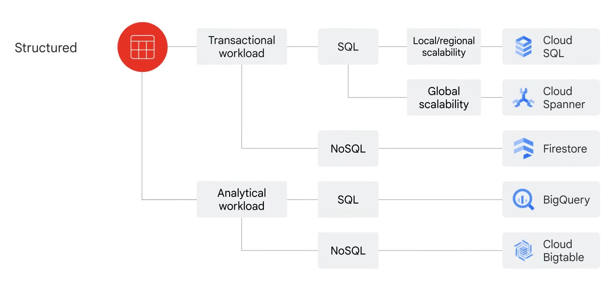

# Big Data and Machine Learning on Google Cloud

**Course Overview**

1. How Compute and Storage enabled BigData and ML capabilities.
2. The history of BigData and ML products
3. Big Data and ML product categories

Reading Material: [Click here](./Reading%20List/01.00_BigData%26ML.pdf)

 

**Intro**

1. **1998**: Google has been working with Data and AI since early 1998.
2. **2008**: Google Cloud platform was launched. Cloud Computing and Storage services.

Google Cloud comprises of 3 layers:

- Base Layer: **Networking & Security**
- Second Layer: **Compute** and **Storage**
- Top Layer: **Big Data and ML Products**

Google decouples Compute and Storage so they can work independently.

Big Data and ML Products allows tasks such as:

- Ingest
- Store
- Process
- Deliver Business Insights
- Data Pipelines
- ML models

 

### **Middle Layer: Compute**

1. Organizations require lots of Compute Power to run Data Jobs.
2. Google Offerings:
   - **Compute Engine**
     - Iaas Offering
     - Raw compute, storage and network capabilities.
     - All organized logically to simulate physical data centers.
   - **Google Kubernetes Engine (GKE)**
     - Runs containerized applications on cloud.
     - All dependencies and code are packaged into one place called containers.
   - **App Engine**
     - Fully managed PaaS offering
     - Bind code to libraries that provide access to infrastructure application needs.
   - **Cloud Functions**
     - Executes code in response to other events
     - Often called Functions as a service.

### **Middle Layer: Storage**

1. For proper scaling capabilities Compute and Storage are decoupled.

2. With cloud computing processing limitations aren't attached to storage disks.
   - Most applications require a Database and Storage solution.
   - Eg: With Compute Engine you can install and run a Database on a VM.
3. Google Offerings:

   - Cloud Storage
   - Cloud BigTable
   - Cloud SQL
   - Cloud Spanner
   - Firestorage

4. The storage bucket can be created through web interface or command line.

5. The above offerings are seperated under Relational, Non-relational databases and Worldwide object storage.

6. Choosing the right storage depends on:

   - Type of data: Structured or Unstructured.
   - Business need

7. Unstructured data or Data stored in non tabular form: Eg: Documents, Images and Audio files.

   - This storage that best fits this need is **Cloud Storage**
   - Storage Class of Cloud Storage:
     - _Standard Storage_: For hot data
     - _Nearline Storage_: For data accessed or modified once per month like backups, etc.
     - _Coldline Storage_: Data accessed once every 90 days.
     - _Archive Storage_: Data accessed or modified Once a year like backups or Disaster recovery. Low cost for storage and very high cost for data access.

8. Structured Data or data in Tabular form: These come in 2 types: _Transactional workloads_ and _Analytical Workloads_.

9. _Structured Data in Transactional workloads_: Step from transactional data from OLTP systems.

   - These require standardized queries that impact few records.
   - If the data will be accessed using SQL the products that can be used are **Cloud SQL** and **Cloud Spanner**
     > Cloud SQL works best for local to regional scalability.
     >
     > Cloud Spanner can scale the database globally.
   - If the data will be access without SQL, **Firestore** will be the best option.
     > Firestore is transactional No-SQL document oriented database.

10. _Strucutured Data in Analytical Workloads_: Stem from OLAP systems.

    - These are used when entire dataset needs to be read and require complex queries like aggregations, etc.
    - If you require SQL queries **BigQuery** is best option.
      > BigQuery allows to analyze petabyte-scale datasets.
    - For No-SQL **Cloud BigTable**
      > BigTable is best for realtime high throughput applications that require millisecond latency.

11. Flowchart: 

 

### **History**

Google faced challenges with Large datasets, Fast-changing data, varied data. Eg: Indexing World Wide Web.

1. 2002: Google released _Google File System (GFS)_

   - Data sharing and petabyte storage at scale.
   - Foundation for Cloud Storage today.

2. 2004: Google released _MapReduce_ to index exploding data.

   - New style of data processing designed to manage large-scale of data processing across big clusters of servers.

3. 2005: Google released _BigTable_ to tackle challenges with recording and retrieving millions of user actions with high throughput.

   - BigTable is high performance No-SQL database service for large analytical and operational workloads.

4. 2008 - 2010: Google introduced _Dremel_ as an alternate to MapReduce. - Google moved away from MapReduce due to developers facing challenges with writing code as opposed to managing infrastructure. - Data was broken into smaller chunks called shards and then compressing them. Dremel then uses optimizer to share tasks between many shards of data in Google data centers to process queries and deliver results. - Big inovation was Dremel was able to autoscale to meet query demands. - Dremel became the query engine behind BigQuery today.

5. 2010: Google launched _Colossus_ which is cluster level file system and successor to Google File System (GFS)

6. 2012: Google released _Cloud Spanner_ which is globally consistent scalable relational database.

7. 2015: Google released _Pub/Sub_ and _TensorFlow_.

   - Pub/Sub which is a service used to streaming analytics and data integration pipelines to ingest and distribute data.
   - TensorFlow which is a free and open source software library for ML and AI

8. 2018: Google introduced first version of _Tensor Processing Unit (TPU)_ which increased the compute power by 200% by using ASIC hardware developed by Google.

9. Other products that comprise the Google's BigData solutions are:
   - _Dataproc_
   - _Dataflow_
   - _Looker_
   - _AutoML_
   - _Vertex AI_

 

### **BigData and ML product categories**

Google products from Data-to-AI workflow can be divided into 4 general categories:

1. Ingestion & Process
2. Storage
3. Analytics
4. Machine Learning

**Ingestion & Process**

Products that are used to digest both real-time and batch data.

Products include:

- Pub/Sub
- DataFlow
- Dataproc
- Cloud Data Fusion

**Data Storage**

Products include:

- Cloud Storage
- Cloud SQL (Relational)
- Cloud Spanner (Relational)
- Cloud BigTable (NoSQL)
- Firestore (NoSQL)

**Analytics**

Products include:

- BigQuery (Fully managed Data Warehouse)
- Google Data Studio (Analyse and Visualization)
- Looker (Analyse and Visualization)

**Machine Learning**

Consists of ML developement platform and AI solutions.

ML developement platform's primary product is Vertex AI. This includes:

- AutoML
- Vertex AI workbench
- TensorFlow

AI solutions are built on ML development platform and are includes Horizontal and Vertical Market needs. These include:

- Document AI
- Contact Center AI
- Retail Product discovery
- Healthcare Data Engine

 

### **Cusomer Case Study: Gojek**

1. Utilized Google Cloud to run it's applications and Data.

2. Issue with Data Latency

   - **Dataflow** for streaming data processing
   - **BigQuery** for real-time business insights.

3. Issue with identifying locations that had too few or too many drivers to meet demand
   - Dataflow to build streaming event data pipeline.
   - This made driver locations ping Pub/Sub every 30 seconds after which Dataflow will process data. Post which the pipeline will aggregate supply pings from drivers against booking requests.
   - This will alert Gojek's notifcation systems to alert drivers where they should go.

> The pipeline should be able to scale up and down based on demand.
>
> Dataflow was able to automatically manage it's workers processing the pipeline to meet demand.
>
> Gojek was able to visualize supply and demand issues.
