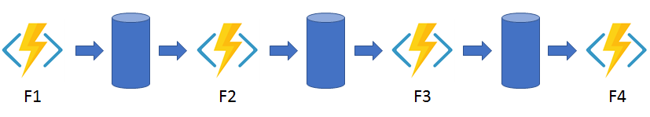
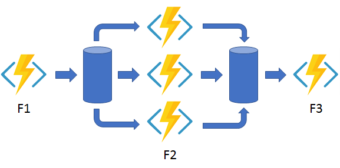
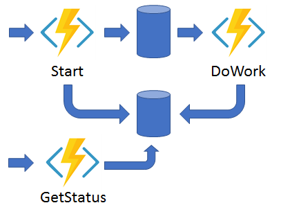
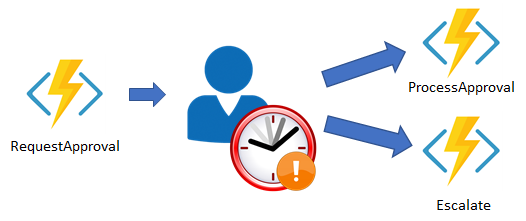

# Durable Functions

## **Module Overview**

1. What are Durable Functions?

2. Benefits of Durable Functions.

3. Durable Function Types.

4. Orchestration function Patterns

5. Design Durable Functions

## **What is Durable Functions?**

Durable functions allow implementation of complex statefull functions in a serverless environment.

**Use Case**

Your company currently follows a manual approval process for project design proposals.  
The process has multiple steps and each step in the process can vary in duration.  
Implementing an automated process in house is complex and costly. In addition, you must be able to incorporate custom logic into the workflow.

**Durable Functions Benefits**

1. Azure functions operate in a stateless environment whereas Durable functions can retain state between function calls.
2. Durable functions scale as needed
3. A durable function can wait asynchronously for one or more external events and then perform a series of tasks in response to these events.
   > You can change functions together, you can implement common patterns such as fan out or fan in which uses one function to invoke others in parallel and then accumulate the results.
4. You can orchestrate and coordinate functions and specify the order in which functions should execute.
   > The state is managed for you, you don't have to write your own code, save state information for a long running function.
5. Durable functions allows you to define state full workflows using an orchestration function. Orchestration function provides the following benefits.
   - You can define the workflows in code, you don't need to write a JSON description or use a workflow.
   - Functions can be called both synchronously and asynchronously.
   - Output from the called functions is saved locally in variables and used in subsequent function calls.
   - Azure **checkpoints** the progress of a function automatically when the function awaits. Azure may choose to dehydrate the function and save its state while the function waits to preserve resources and reduce costs. - When the function starts running again, azure will rehydrated it and restore it's state.

### **Function Types**

1. Client
2. Orchestrator
3. Activity

**Client Functions**

Client functions are the _entry point_ for creating an instance of a durable functions orchestration.
They can _run in response to events_ from many sources, such as a new http request arriving or a message being posted to a message queue or an event arriving in an event stream.
You can write them in any of the supported languages.

**Orchestrator functions**

Describe how actions are executed and the order in which they are run.
You write the orchestration logic in code C# or JavaScript

**Activity functions**

These are the basic units of work in a durable function Orchestration.
An activity function contains the actual work performed by the tasks being orchestrated.

 

### **Orchestration Function Patterns**

You can use durable functions to implement many common workflow patterns.

1. Function chaining
2. Fan out/fan in
3. Async HTTP APIs
4. Monitor
5. Human interaction

 

**Function Chaining**

In the function chaining pattern, the workflow executes a sequence of functions in a specified order.

The output of one function is applied to the input of the next function in the sequence

The output of the final function is used to generate a result.

 

**Fan out/fan in**

This pattern runs multiple functions in parallel and then waits for all the functions to finish.

The results of the parallel executions can be aggregated or used to compute a final result.

 

**Async HTTP APIs**

The async HTTP APIs pattern addresses the problem of coordinating state of long running operations with external clients.

1. A http call can trigger the long running action.
2. Then it can redirect the client to a status endpoint.
3. The client can learn when the operation is finished by polling this endpoint.

 

**Monitor**

This pattern implements a recurring process in a workflow, possibly looking for a change in state.

For example, you could use this pattern to poll until specific conditions are met.

 

**Human Interaction**

This combines automated processes that also involves some human interaction.

> A manual process within an automated process is tricky because people aren't as highly available and as responsive as most computers.

Human interaction can be incorporated using timeouts and compensation logic that runs if the human fails to interact correctly within a specified response time.

An approval process is an example of a process that involves human interaction.

 

## **Design a workflow using Durable Functions**

Now we will look at how to design a workflow based on Durable Functions.

1. You can use Durable Functions to orchestrate a long-running workflow as a set of activities.

2. You can map each step in the process to a function type and each task to an activity.

3. **Timeouts or Escalation paths**: Having an automated process means you don't have to worry about manually monitoring or manually escalating a task if it isn't done.

   > As we continue to think about automating our approval process, we need to consider the cases when a step in the process does not complete in time and needs to be escalated. For example, what if we need a manager's approval for a particular size of proposal, but the manager is late with a response?  
   > Escalation steps are useful to this business as it moves along a task when a deadline has been reached, it ensures tasks are completed and not forgotten.

   > An escalation step could involve sending out reminders or even reassigning a task to someone higher up the managerial hierarchy.

 

**Lab**

1. Our workflow begins when a project design is submitted for approval.

2. An approval task is allocated to a manager so they can review the project design proposal.

3. The manager will either approve or reject the proposal. In the real world, this event would generate and send a notification to the proposal author to let them know the outcome of the approve/reject request.

4. An escalation task is allocated if the approval task isn't completed within a predefined time limit.

5. The status of the task would then be changed to either approved or rejected.

In this example, it's possible to map the workflow steps to the function types used in a Durable Functions workflow:

- For example, submitting a project design proposal for approval could map to the _**Client function**_.
- Assigning an approval task to a relevant member of staff could map to the _**Orchestration function**_.
- The approval task could map to the activity function. An escalation task could map to the _**Activity function**_.

 

**Lab**

[Exercise - Create a workflow using Durable Functions](https://docs.microsoft.com/en-us/learn/modules/create-long-running-serverless-workflow-with-durable-functions/4-exercise-create-a-workflow-using-durable-functions)

 
