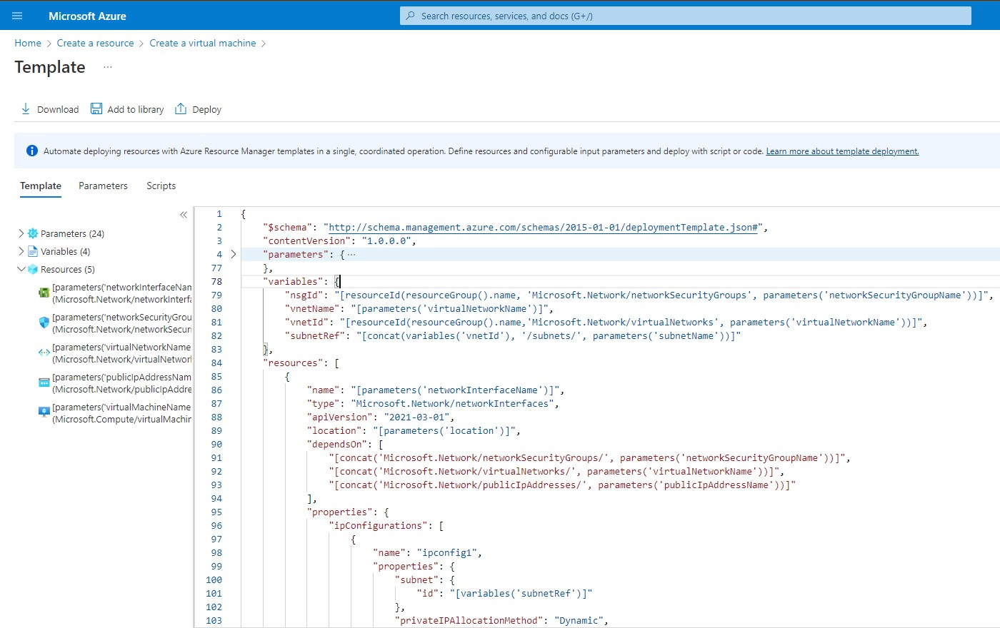

# Deploying Methods

## **PowerShell**

PowerShell File Link: [_here_](./resources/1-CreateVMs.ps1)

 

## **CLI**

MS Docs Link: [_here_](https://docs.microsoft.com/en-us/azure/virtual-machines/windows/quick-create-cli)

 

## **ARM in Azure Portal**

We can deploy resources entirely using ARM templates.  
In this module we will be working with VM ARM templates.

1. Go to Azure Portal > Create new resource > Compute > VM
2. Fill in the necessary details for RG, VM Name, OS and plan, Creds and click on review and create.
3. Before finally clicking on creating find and click on the link "Download ARM Template".

 

### **Exploring Template**

We can download the template, Add to library for future or Deploy using the template.

The current ARM template consists:

- Parameters: Values for unique deployments allowing us to change them at runtime.
  > Parameters that are part of template are just declarations of types. The actual parameter file contains the values for the actual resources.
- Variables
- Resources

 

**Parameters**

Contains several values:

1. Location: We have a location parameter with value "southindia"
2. networkInterface: An auto generated name for network interface.
3. networkSecurityGroupName: Name for NSG
4. networkSecurityGroupRules: Allowing value to define rule values:
   - name
   - properties: further defining rule details.
5. And so on...

Decoupling these values allow us to use template again and again by changing values.

 

**Variables**

Are used to define values for reuse in a template.

1. nsgid:

   - We can see a system function being used called resourceID. This will return the resource ID of a defined resource into the variable nsgid.
   - The parameter for the resourceID function call we can see the name of the resource group being passed in.
   - Next we see the type of resource which is networkSecurityGroups.
   - In the last parameter in the function we can see reference to the template parameters list from above which then references to the value coming from the parameters file.

2. vnetId:

   - We see a similar pattern as nsgId here where a similar parameter is being passed to retireve the value of ventId

3. subnetRef:

   - It uses another system function concat, to concatenate together the values of vnetId variable, string '/subnets/' and value of the parameter named subnetName.

 

**Resources**

These are actual resources being deployed in Azure by this ARM template.

1. The first resource we see is networkInterface that will get attached to VM.

   - In the resource definition dependsOn we see list of resources that the current resource depends on before being deployed.
   - Therefore by ordering we know that these are the resources that gets created first. And our networkInterface won't be created until these 3 are deployed.

2. Going further we will also see that the subnet Id references to the subnetRef variable that this network interface will attach itself to.

3. Going down further we will see the virtualMachine definition which we want to deploy in this template. This definition has a dependsOn section where we see networkInterfaceName parameter being referenced.
   - In it's properties we can see the other components requried to deploy the VM.
   - Like Hardware profile which defines VM size which comes from parameter named virtualMachineSize.
   - And the remaining

> For Exams must know how Parameters, Variables and Resources are used in different sections of the ARM template.
>
> For Eg: How concat was used to combine values, or how resources are referenced in resource definitions.

 

**Extra Links:**

ARM Template files for Azure VM: [_ARM Template zip_](./resources/template.zip)
